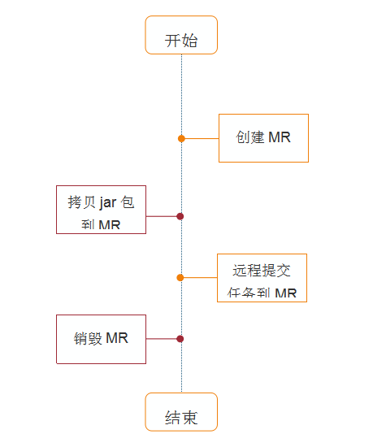
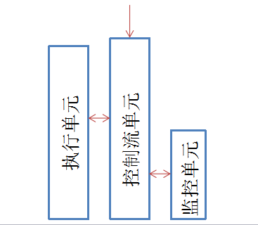

### Welcome to use MarkDown
## 设计思路
* 创建弹性MR集群  
* 远程拷贝jar包
* 提交任务到弹性MR集群
* 任务结束后销毁弹性MR集群

## 程序流程

## 程序结构


    结构说明：
        控制流单元：整个程序的主线也是程序的入口。用于管理控制各个模块的运行，包括拷贝jar包到MR及任务提交
        执行单元：贯穿整个程序的始末。主要用于创建MR，获取MR状态，获取MR ip，销毁MR
        监控单元：主要用于对提交的任务的监控。开始于任务提交，与控制流单元同时结束。并且如果任务两小时未结束，强制退出控制流单元并销毁MR。

## 模块分析
### 控制流单元
控制流单元作为程序的主线，主要负责调度执行单元，监控单元的运行及任务的提交。具体执行单元和监控单元的运行原理会在这两个模块做详细说明，在控制流单元需要注意的有四点。
首先是必须以root身份来运行脚本，因为一些命令或文件除root之外的用户不能够很方便的操作，在脚本中下面这段代码说明了这一点。
```bash
user_id=`id -u`
if [ $user_id -ne 0 ];then
    echo "Permision denied. only root"
    exit 9
fi
```

其次是在弹性MR刚创建时不能直接进行下一步，需要等待弹性MR完全创建成功后继续执行，创建的过程可能会持续6-9分钟，代码如下。

```bash
... ...
status=`python emrdemo.py -a EmrDescribeCluster`
while [ $status -ne 2 ]
do
    sleep 20
    status=`python emrdemo.py -a EmrDescribeCluster`
done
... ...
```

第三是ssh连接及执行远程命令问题。在远程拷贝和远程提交任务时，scp/ssh每次都是首次连接，那么就得需要authenticity，会提示用户是否信任该主机，一行命令不足以完成这个操作。但是scp/ssh如果加-o StrictHostKeyChecking =no就会很优雅的避开了这个认证。从而完成操作。

并且scp/ssh本身只支持在交互式输入密码，但是我们必须得通过命令行传参的形式来输入密码，那怎么办呢？兵来将挡，一种办法可以通过第三方工具sshpass来实现，这个工具需要额外安装，附件中会有sshpass安装过程，当然还有其他的办法，以后慢慢探究。代码格式如下。

```bash
... ...
$sshpass -p"$emrPass" scp -o StrictHostKeyChecking=no $jar_name $submit_name  root@$emrIp:$emr_path
$sshpass -p"$emrPass" ssh -tt -o StrictHostKeyChecking=no root@"$emrIp" chmod 777 $jar_name $emr_path/ $submit_name
... ...
```

在上面命令代码中ssh 后还跟了一个参数 -tt ，这个参数的主要作用是提供一个远程服务器的虚拟终端tty来执行远程命令，否则ssh 执行远程命令是会失败的，尤其是sudo命令。
最后在每次任务提交后，会不断获取任务的运行状态，直至任务运行结束才会进入下一步操作。

```bash
... ...
while true ;do
        status=$($sshpass  -p"$emrPass" ssh -tt root@$emrIp "/usr/local/service/hadoop/bin/yarn application -list"  | awk '/^application/{print $2,$1,$6}')
        echo `date "+%F %T"` $status
        status=$(echo $status| awk '{print $3}')
        [ "$status" != '' ]  && sleep 60  || break
done
... ...
```

### 执行单元

执行单元贯穿于整个程序的始末。用于创建MR集群，获取MR状态，获取MR ip，销毁MR，更像是一个工具，随用随执行。下面来说一下脚本的具体内容。

引入云API入口模块

#### 创建MR
- 接口名：EmrCreateCluster
- 接口请求域名：emr.api.qcloud.com
- 接口输入参数：[参考见附件1](emr文档.md#附件1)  
- 公共输入参数：[参考见附件2](emr文档.md#附件2)


## 附件1 
### 公共接口参数

|参数名称	|是否必选|	类型	|描述|
|----|----|----|----|
|ProductId	|是|	uint|	EMR版本ID|
|ZoneId|	是	|uint|	所在地域可用区ID|
|VpcId	|是	|string	|创建EMR集群所在的私有网络vpcId, vpc-xxxxx格式|
|SubnetId	|是	|string|	创建EMR集群的所在的私有网络subnetId, subnet-xxxx格式|
|SoftInfo.n	|是|	array string|	需要安装的软件包|
|MasterNodes|	是	|uint|	master节点个数|
|CoreNodes	|是	|uint|core节点个数|
|TaskNodes|	否	|uint|	task节点个数|
|MasterSpec	|是|	string|	master节点机器规格，参见cvm实例配置|
|MasterStorageType|	否|	uint|	master节点存储类型，1：本地盘，2：云盘，3：SSD本地盘，默认1|
|MasterRootSize|	否	|uint	|单位GB，master节点系统盘容量，默认20G|
|MasterMemory |	是	|uint	|单位MB, master节点内存容量|
|MasterCpuCores|	是	|uint	|master节点cpu核数|
|MasterVolume	|是	|uint|	单位GB,master节点数据盘容量|
|CoreSpec|	是	|string	|core节点机器规格，参见cvm实例配置|
|CoreStorageType	|否|	uint|	core节点存储类型，1：本地盘，2：云盘，3：SSD本地盘，默认1|
|CoreRootSize	|否	|uint|	单位GB，core节点系统盘容量，默认20G|
|CoreMemory	|是	|uint	|单位MB, core节点内存容量|
|CoreCpuCores	|是	|uint|	core节点cpu核数|
|CoreVolume|	是	|uint|	单位GB,core节点数据盘容量|
|TaskSpec	|否	|string|	若TaskNodes不为0，该字段有效。task节点机器规格，参见cvm实例配置|
|TaskStorageType	|否	|uint|	若TaskNodes不为0，该字段有效。task节点存储类型，1：本地盘，2：云盘，3：SSD本地盘，默认1|
|TaskRootSize	|否|	uint|	若TaskNodes不为0，该字段有效。单位GB，task节点系统盘容量，默认20G|
|TaskMemory	|否	|uint	|若TaskNodes不为0，该字段有效。单位MB, task节点内存容量|
|TaskCpuCores	|否	|uint	|若TaskNodes不为0，该字段有效。task节点cpu核数|
|TaskVolume	|否	|uint|	若TaskNodes不为0，该字段有效。单位GB,task节点数据盘容量|
|Password	|是	|string|	初始密码，用于cvm,cdb的初始root密码|
|VisitCos	|是|	uint|	是否集成cos。0：不集成,非0：集成|
|LogOnCosPath	|否	|string	|集成cos后，存储软件运行日志的cos路径地址|
|CosSecretId	|否	|string	|访问cos的SecretId,参见COS基本概念-SecretId/SecretKey|
|CosSecretKey	|否	|string|	访问cos的SecretKey,参见COS基本概念-SecretId/SecretKey|
|SupportHA	|是	|uint|	是否支持高可用|


## 附件2
### 公共输入参数
|名称	|类型	|描述	|必选|
|----|----|----|----|
|Action	|String	|接口指令的名称，例如: DescribeInstances|	是|
|Region	|String	|区域参数，用来标识希望操作哪个区域的实例。可选:  bj:北京   gz:广州  sh:上海    hk:香港  ca:北美  sg:新加坡  usw:美西  cd:成都  de:德国  kr:韩国  shjr:上海金融 szjr:深圳金融  gzopen:广州OPEN  |是|
|Timestamp|	UInt	|当前UNIX时间戳	|是|
|Nonce|	UInt	|随机正整数，与 Timestamp 联合起来, 用于防止重放攻击	|是|
|SecretId	|String|	由腾讯云平台上申请的标识身份的 SecretId 和 SecretKey, 其中 SecretKey 会用来生成 Signature具体参考 接口鉴权 页面	|是|
|Signature	|String	|请求签名，用来验证此次请求的合法性, 具体参考 接口鉴权 页面	|是|

